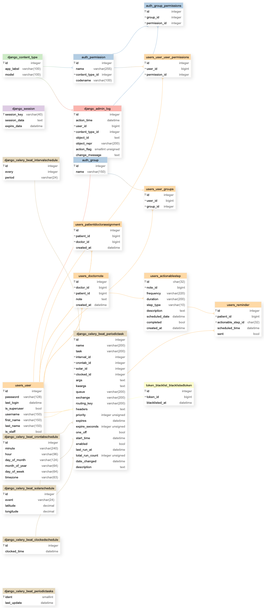
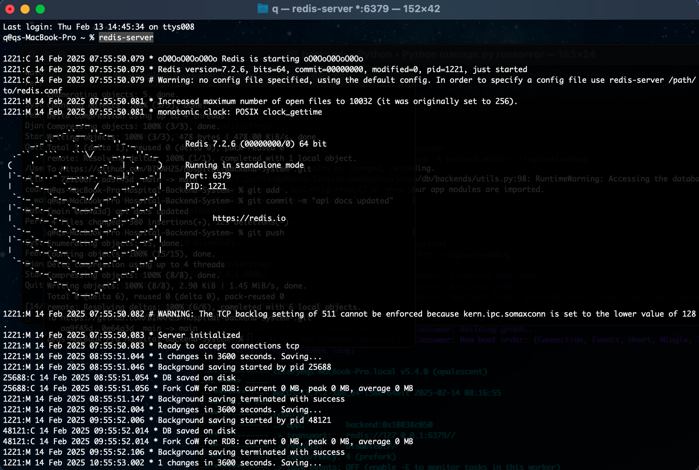
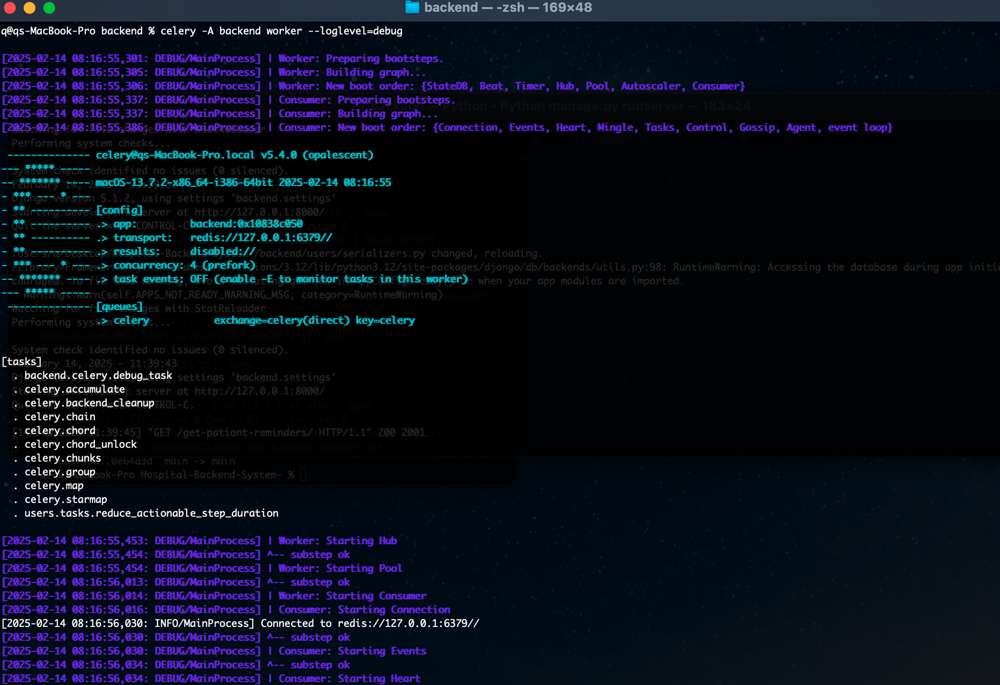

# Hospital Backend System
## Overview
This is a backend system for a hospital that handles user signups, patient–doctor assignments, doctor note submissions, and dynamic scheduling of actionable steps based on live LLM processing. The system ensures data security through encryption and leverages Celery and Redis for background task processing.

| API DOCUMENTATION URL and ENDPOINTS| https://github.com/BINAH25/Hospital-Backend-System-/blob/main/backend/api_documentation.md|
| ---------------------|--------------------------------------------------------------------------------------------|

# Documentation & Justification of Design

## Authentication Strategy

I use Django's built-in authentication system with Django Rest Framework (DRF) and JWT (JSON Web Token). This provides secure authentication while allowing seamless API-based interactions.

## Password Storage

Passwords are securely stored using Django's default password hashing mechanism (PBKDF2), which ensures robust security against brute-force attacks.

## Data Encryption

To protect sensitive data, especially doctor notes, I use end-to-end encryption (E2EE). Notes are encrypted using AES-256 before storage, ensuring only the doctor and patient can decrypt and view them. The encryption key is securely managed and not stored alongside the data.

## Scheduling Strategy
Technology Choice: Celery, Redis, and Celery Beat
- Celery (Task Queue): Handles asynchronous processing of LLM-generated tasks and scheduling reminders efficiently.
- Redis (Message Broker): Acts as an in-memory store for Celery, ensuring low-latency task execution.
- Celery Beat (Periodic Task Scheduler): Manages the scheduling of reminders based on the actionable steps extracted from the LLM.

## Scheduling Logic
- From the doctor’s note, Gemini Flash extracts the duration of the prescription plan.
- A function runs every day at 6 AM to check whether the duration is greater than 0.
- If duration > 0, an email is sent to the patient reminding them to check in.
- If the patient checks in, the duration is decreased by 1.
- If the patient does not check in, the duration remains the same.
- The scheduler continues running until the duration reaches 0.
Example: If a prescription plan lasts 5 days, the scheduler will run at 6 AM daily for a maximum of 5 days. However, if the patient skips a check-in, the duration does not decrease, meaning the reminders will continue beyond 5 days until the patient completes 5 successful check-ins.


## Data Storage
- PostgreSQL is used as the primary database for structured storage of users, doctor notes, and actionable steps.
- Encrypted Fields ensure that sensitive patient data remains secure.
- Redis is utilized for caching and managing Celery task queues efficiently.

## ER Diagram of Database Design


## Key Features

1. **User Management** : Signup, authentication, and role-based access control (Patients and Doctors).

2. **Doctor-Patient Assignment**: Patients select a doctor; doctors view their assigned patients.

3. **Doctor Notes & LLM Integration**: Doctors submit encrypted notes, and an LLM extracts actionable steps.

4. **Dynamic Scheduling** Dynamic Scheduling: Automated reminders based on the treatment plan, dynamically adjusting for missed check-ins.

5. **Background Task Processing**: Uses Celery and Redis for handling scheduled tasks.

## Tech Stack

1. **Backend Framework**: Django & Django Rest Framework (DRF)

2. **Authentication**: Django SimpleJWT

3. **Task Queue**:Celery with Redis as the message broker

4. **Database**:PostgreSQL

5. **Encryption**:AES encryption for patient notes

6. **LLM Processing**: Google Gemini Flash

## Installation

### Prerequisites

Ensure you have the following installed:

Python 3.10

Redis

## Setup
1. **Clone the Repository:**
   ```bash
   https://github.com/BINAH25/Hospital-Backend-System-.git
   cd Hospital-Backend-System-

2. **Create Virtual Environment:**
   ```bash
   python -m venv venv
   source venv/bin/activate  # On Windows, use `venv\Scripts\activate`

3. **Install the requires packages:**
   ```bash
   cd backend
   pip install -r requirements.txt


4. **Run the following commands:**
   ```bash
   python manage.py makemigrations
   python manage.py migrate

5. **Start Redis server:**
   ```bash
   python manage.py createsuperuser 

6. **Run the server:**
   ```bash
   redis-server


7. **Start Celery worker:**
   ```bash
   celery -A backend worker --loglevel=debug


8. **Visit the url below to display the login page:**
   ```bash
   http://127.0.0.1:8000/
